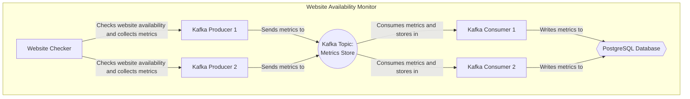

# WebsiteAvailabilityMonitor

## Introduction
WebsiteAvailabilityMonitor is a tool for monitoring the availability of websites 
and collecting metrics about their performance. 
It uses a Kafka producer to periodically check target websites and sends the check 
results to a Kafka topic. 
A Kafka consumer then stores the data in an PostgreSQL database.

## Features
- Monitor multiple websites
- Collect HTTP response time and status code
- Optionally check for a regular expression pattern in the returned page content
- Store the collected data in an PostgreSQL database

## Installation and Setup
1. Clone the repository:
   ```
   git clone https://github.com/connormclaud/WebsiteAvailabilityMonitor.git
   ```
2. Install the required dependencies:
   ```
   pip install -r requirements.txt
   ```
3. Set up the necessary environment variables:
   ```
   export KAFKA_URL=<your-kafka-url>;
   export POSTGRESQL_URL=<your-postgresql-url>;
   ```
4. Configure the target websites and other settings in the `config.yml` file.

## Usage Instructions
1. Run the Kafka producer:
   ```
   python kafka_producer.py
   ```
2. Run the Kafka consumer:
   ```
   python kafka_consumer.py
   ```

## Contributing
We welcome contributions to the WebsiteAvailabilityMonitor project. Please follow these steps to contribute:

1. Create a fork of the repository on GitHub.
2. Clone your fork to your local machine.
   ```
   git clone https://github.com/your-username/WebsiteAvailabilityMonitor.git
   ```
3. Create a new branch for your feature or bugfix.
   ```
   git checkout -b your-feature-branch
   ```
4. Implement your changes and add tests as necessary.
5. Commit your changes to your branch.
   ```
   git add .
   git commit -m "Your commit message"
   ```
6. Push your changes to your fork on GitHub.
   ```
   git push origin your-feature-branch
   ```
7. Create a pull request on the original repository, comparing your feature branch to the main branch.

Please ensure that your code follows the project's style guidelines and that all tests are passing before submitting a pull request.

# Architecture and Design
The WebsiteAvailabilityMonitor project is divided into three main components: the website checker, the Kafka producer, and the Kafka consumer. The architecture is designed to be modular, scalable, and easy to maintain.



## Website Checker
The website checker is responsible for periodically checking the target websites and collecting the HTTP response time, status code, and optionally checking the returned page contents for a specified regex pattern. This component is designed to be easily extensible, allowing for the addition of new checks and metrics in the future.

## Kafka Producer
The Kafka producer receives the results of the website checks and sends the data to a Kafka topic. This component is designed to be highly performant and fault-tolerant, ensuring that the data is reliably sent to the Kafka topic even in the event of network issues or other errors.

## Kafka Consumer
The Kafka consumer listens for messages on the Kafka topic and writes the data to an PostgreSQL database. This component is designed to handle a large number of checks and efficiently write the data to the database, ensuring data integrity and performance.

The modular design of the project allows for each component to be developed, tested, and deployed independently, improving the overall maintainability and scalability of the system.

## License
This project is licensed under the [MIT License](LICENSE).

## Support
If you encounter any issues or have questions about the project, please open an issue on the GitHub repository or contact the project maintainers.